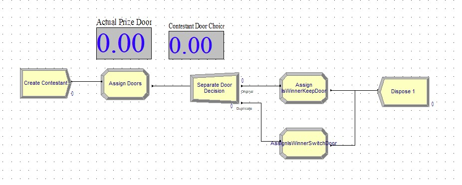

# MonteHallArenaSim
Simulation of the Monte Hall Problem using Arena simulation software

## Monte Hall Problem

https://en.wikipedia.org/wiki/Monty_Hall_problem

## Basic Overview of Simulation

1. Create contestants at a fixed interval
1. Randomly assign two doors:
    * "Hidden" prize door (X_p)
    * Contestant's chosen door (X_c)
    * Each door assignment (X) is independent and identically distributed as:
        * P(X = 1) = 1/3, P(X = 2) = 1/3, P(X = 3) = 1/3
1. A contestant "IsWinner" if their final door choice matches the original prize door 
    * IsWinner = (x_p == x_c)
1. The contestant with their chosen door are duplicated into two scenarios:
    * "KeepDoor": Contestant keeps their original door choice.
    * "SwitchDoor": Contestant switches to the other available door.
        * Details: The simulation really just checks to see if the original door choice matched, if it did, then they lost when they switched. 
1. Two variables track the number of total winners in each scenario:
    * NumWinnersKeepDoor 
    * NumWinnersSwitchDoor
